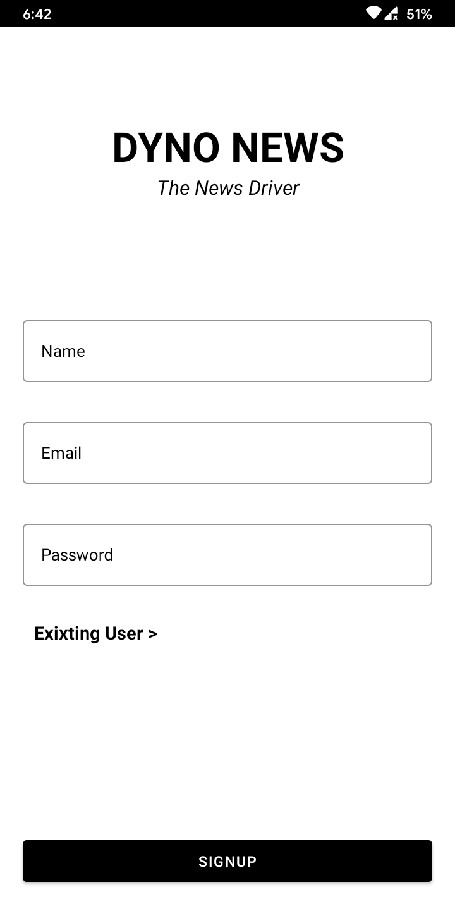
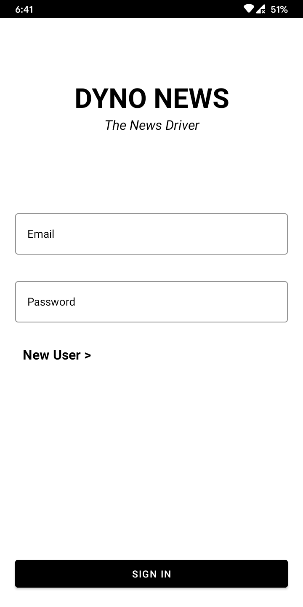
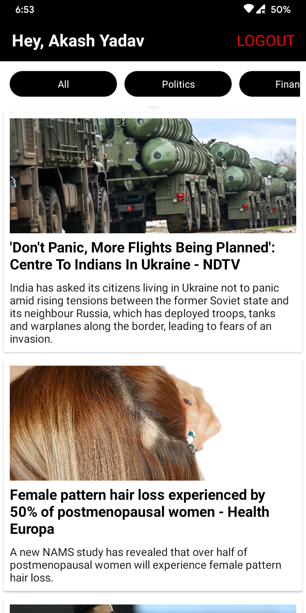

# Hi 👋, Reader
## Dyno Android App
This is a news app developed just to get basic idea about android .

## Languages and Tools 
🔥
```CSS
   Java
   Retrofit => For API 
   Firebase => For Authentication
   XML
```

## How th project works ?
* The Core app is developed using java.
* Firebase act as a backend for authentication purpose.
* Retrofit is used to fetch data form **[newsapi](https://newsapi.org/)**


### Here is the apk file 👇
[Dyno](https://drive.google.com/file/d/1ZzF5eQB24XlrYY32dbTBYj1sPBN1sEvf/view?usp=sharing)


## Screenshots

#### Signup

#### Login
 
#### Home Screen
 
#### Short Description Screen


